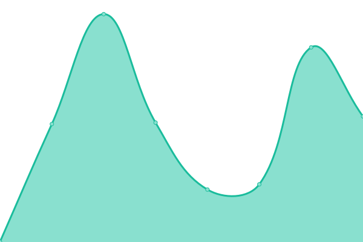
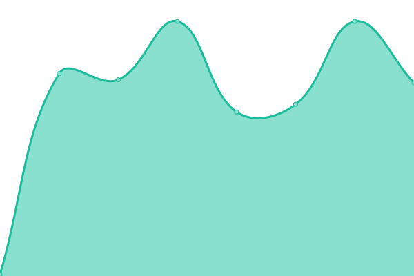
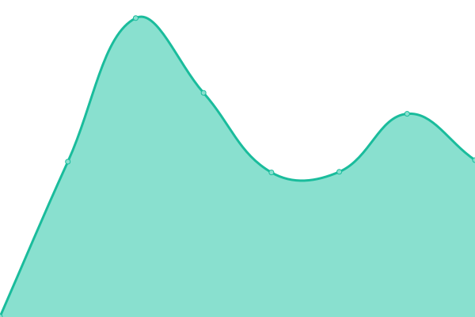

# [📈 Live Status](https://creadi.github.io/emmalife-upptime): <!--live status--> **🟩 All systems operational**

This repository contains the open-source uptime monitor and status page for [Creadi AG](https://www.creadi.ch), powered by [Upptime](https://github.com/upptime/upptime).

With [Upptime](https://upptime.js.org), you can get your own unlimited and free uptime monitor and status page, powered entirely by a GitHub repository. We use [Issues](https://github.com/creadi/emmalife-upptime/issues) as incident reports, [Actions](https://github.com/creadi/emmalife-upptime/actions) as uptime monitors, and [Pages](https://creadi.github.io/emmalife-upptime) for the status page.

<!--start: status pages-->
<!-- This summary is generated by Upptime (https://github.com/upptime/upptime) -->
<!-- Do not edit this manually, your changes will be overwritten -->
<!-- prettier-ignore -->
| URL | Status | History | Response Time | Uptime |
| --- | ------ | ------- | ------------- | ------ |
|  [www.emmalife.ch](https://www.emmalife.ch) | 🟩 Up | [www-emmalife-ch.yml](https://github.com/creadi/emmalife-upptime/commits/HEAD/history/www-emmalife-ch.yml) | 

 442ms
     
 | 

<a href="https://creadi.github.io/emmalife-upptime/history/www-emmalife-ch">100.00%</a>
    

|  [emmalife.ch](https://emmalife.ch) | 🟩 Up | [emmalife-ch.yml](https://github.com/creadi/emmalife-upptime/commits/HEAD/history/emmalife-ch.yml) | 

 481ms
     
 | 

<a href="https://creadi.github.io/emmalife-upptime/history/emmalife-ch">100.00%</a>
    

|  [Life API - Flex Quote](https://dev.api.emmalife.ch/products/FxUf8OlzM/quotes) | 🟩 Up | [life-api-flex-quote.yml](https://github.com/creadi/emmalife-upptime/commits/HEAD/history/life-api-flex-quote.yml) | 

 511ms
     
 | 

<a href="https://creadi.github.io/emmalife-upptime/history/life-api-flex-quote">100.00%</a>
    

|  [Life API - Fix Quote](https://dev.api.emmalife.ch/products/FxUf8OlzM/quotes) | 🟩 Up | [life-api-fix-quote.yml](https://github.com/creadi/emmalife-upptime/commits/HEAD/history/life-api-fix-quote.yml) | 

 125ms
     
 | 

<a href="https://creadi.github.io/emmalife-upptime/history/life-api-fix-quote">100.00%</a>
    

|  [Life API - Fix (Digital) Quote](https://dev.api.emmalife.ch/products/NYrnfYEvk/quotes) | 🟩 Up | [life-api-fix-digital-quote.yml](https://github.com/creadi/emmalife-upptime/commits/HEAD/history/life-api-fix-digital-quote.yml) | 

 412ms
     
 | 

<a href="https://creadi.github.io/emmalife-upptime/history/life-api-fix-digital-quote">100.00%</a>
    

|  [Life API - Short link](https://api.life.creadi.ch/sl) | 🟩 Up | [life-api-short-link.yml](https://github.com/creadi/emmalife-upptime/commits/HEAD/history/life-api-short-link.yml) | 

 368ms
     
 | 

<a href="https://creadi.github.io/emmalife-upptime/history/life-api-short-link">100.00%</a>
    

|  [Vlot <> Heroku Proxy (Dev)](https://dev.vlot.api.emmalife.ch) | 🟩 Up | [vlot-heroku-proxy-dev.yml](https://github.com/creadi/emmalife-upptime/commits/HEAD/history/vlot-heroku-proxy-dev.yml) | 

 647ms
     
 | 

<a href="https://creadi.github.io/emmalife-upptime/history/vlot-heroku-proxy-dev">100.00%</a>
    

|  [Vlot <> Heroku Proxy (Prod)](https://vlot.api.emmalife.ch) | 🟩 Up | [vlot-heroku-proxy-prod.yml](https://github.com/creadi/emmalife-upptime/commits/HEAD/history/vlot-heroku-proxy-prod.yml) | 

 658ms
     
 | 

<a href="https://creadi.github.io/emmalife-upptime/history/vlot-heroku-proxy-prod">100.00%</a>
    

<!--end: status pages-->

[**Visit our status website →**](https://creadi.github.io/emmalife-upptime)

## 📄 License

- Powered by: [Upptime](https://github.com/upptime/upptime)
- Code: [MIT](./LICENSE) © [Creadi AG](https://www.creadi.ch)
- Data in the `./history` directory: [Open Database License](https://opendatacommons.org/licenses/odbl/1-0/)
