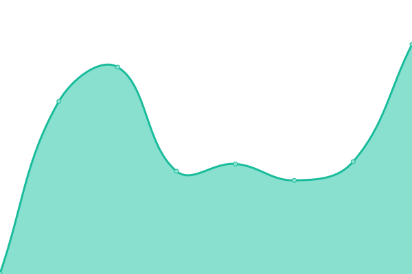

# [📈 Live Status](https://creadi.github.io/emmalife-upptime): <!--live status--> **🟧 Partial outage**

This repository contains the open-source uptime monitor and status page for [Creadi AG](https://www.creadi.ch), powered by [Upptime](https://github.com/upptime/upptime).

With [Upptime](https://upptime.js.org), you can get your own unlimited and free uptime monitor and status page, powered entirely by a GitHub repository. We use [Issues](https://github.com/creadi/emmalife-upptime/issues) as incident reports, [Actions](https://github.com/creadi/emmalife-upptime/actions) as uptime monitors, and [Pages](https://creadi.github.io/emmalife-upptime) for the status page.

<!--start: status pages-->
<!-- This summary is generated by Upptime (https://github.com/upptime/upptime) -->
<!-- Do not edit this manually, your changes will be overwritten -->
<!-- prettier-ignore -->
| URL | Status | History | Response Time | Uptime |
| --- | ------ | ------- | ------------- | ------ |
|  [www.emmalife.ch](https://www.emmalife.ch) | 🟩 Up | [www-emmalife-ch.yml](https://github.com/creadi/emmalife-upptime/commits/HEAD/history/www-emmalife-ch.yml) | 

 1030ms
     
 | 

<a href="https://creadi.github.io/emmalife-upptime/history/www-emmalife-ch">100.00%</a>
    

|  [emmalife.ch](https://emmalife.ch) | 🟩 Up | [emmalife-ch.yml](https://github.com/creadi/emmalife-upptime/commits/HEAD/history/emmalife-ch.yml) | 

 639ms
     
 | 

<a href="https://creadi.github.io/emmalife-upptime/history/emmalife-ch">100.00%</a>
    

|  [Life API - Quotes](https://api.life.creadi.ch/life/quotes) | 🟥 Down | [life-api-quotes.yml](https://github.com/creadi/emmalife-upptime/commits/HEAD/history/life-api-quotes.yml) | 

 516ms
     
 | 

<a href="https://creadi.github.io/emmalife-upptime/history/life-api-quotes">100.00%</a>
    

|  [Life API - Short link](https://api.life.creadi.ch/sl) | 🟩 Up | [life-api-short-link.yml](https://github.com/creadi/emmalife-upptime/commits/HEAD/history/life-api-short-link.yml) | 

 114ms
     
 | 

<a href="https://creadi.github.io/emmalife-upptime/history/life-api-short-link">100.00%</a>
    

<!--end: status pages-->

[**Visit our status website →**](https://creadi.github.io/emmalife-upptime)

## 📄 License

- Powered by: [Upptime](https://github.com/upptime/upptime)
- Code: [MIT](./LICENSE) © [Creadi AG](https://www.creadi.ch)
- Data in the `./history` directory: [Open Database License](https://opendatacommons.org/licenses/odbl/1-0/)
